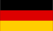
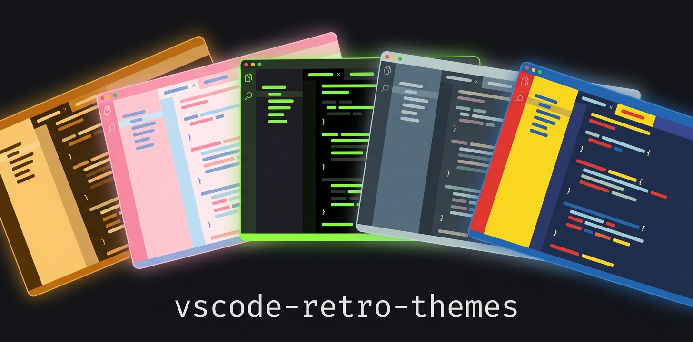
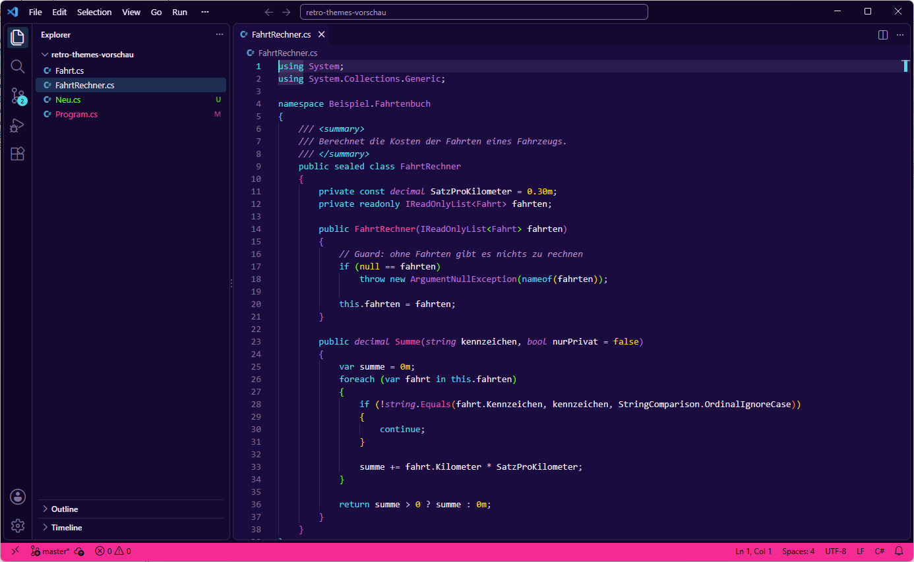
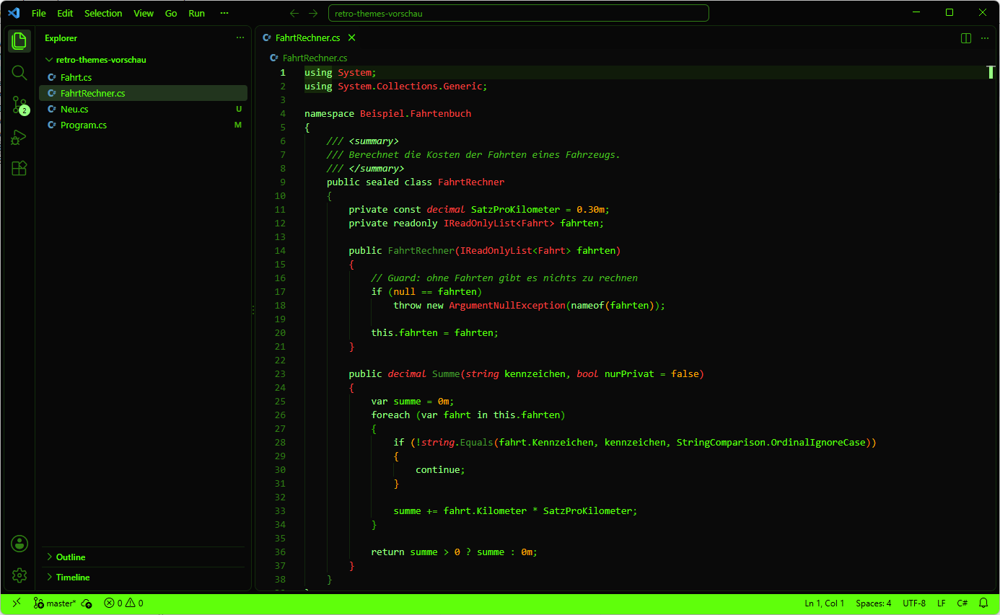
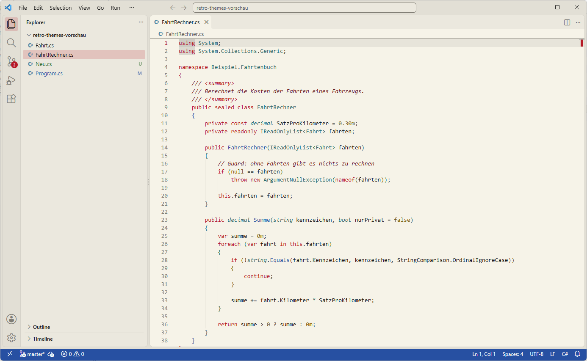

# Retro Themes for VS Code

<p align="center">
   <a href="README.md">English</a> ·
   <b>Deutsch</b>
</p>

---

<p align="center">
  
</p>

[](https://github.com/michaelblaess/vscode-retro-themes/stargazers)
[](https://github.com/michaelblaess/vscode-retro-themes/network/members)
[](https://github.com/michaelblaess/vscode-retro-themes/issues)
[](https://github.com/michaelblaess/vscode-retro-themes/pulls)

[](https://github.com/michaelblaess/vscode-retro-themes/commits/main)
[](LICENSE)
[](https://code.visualstudio.com/)
[](themes)
[](https://marketplace.visualstudio.com/items?itemName=michaelblaess.retro-themes)

41 Farb-Themes für VS Code, 36 dunkle und 5 helle — Paletten im Stil von Vintage-8-Bit, Terminal-Phosphor, Unix-Workstation, Armbanduhren, Comic-Pulp, 80er-Pastell und Mafia-Noir.

Die Paletten stammen aus dem Python-Paket [textual-themes](https://github.com/michaelblaess/textual-themes), die Ableitung teilt sich die Erweiterung mit [nvim-retro-themes](https://github.com/michaelblaess/nvim-retro-themes). So sieht dasselbe Theme in deinen Terminal-TUI-Apps, in Neovim und in VS Code gleich aus.

Die Farben sind nicht eins zu eins übernommen. Eine Palette für eine TUI hat kleine Textfelder, ein Editor ist eine einzige große Textfläche. Jede Farbe wird deshalb geprüft und angehoben, bis sie lesbar ist, und Syntaxfarben, die sich ähneln würden, werden auseinandergezogen.



Oben Synthwave, darunter Classic Terminal und Clipper. **[Alle 41 Themes ansehen](docs/vorschau.de.md)**





> **⚠ Markenrechtlicher Hinweis**
>
> Dies ist ein **unabhängiges, von Fans erstelltes, nicht-kommerzielles**
> Projekt. Die Theme-Namen beschreiben ausschließlich den visuellen Stil —
> es werden keine Marken Dritter als Theme-Namen verwendet. Jeder
> verbleibende Markenbezug in beschreibendem Text (z. B. "PETSCII style",
> "GEM Desktop") ist rein beschreibend und steht in keiner Verbindung zu
> den jeweiligen Markeninhabern, wird von ihnen nicht unterstützt und ist
> nicht von ihnen lizenziert.

## Dunkle Themes (36)

| Theme | Stil |
|-------|------|
| **Brotkasten** | Hellblau auf Königsblau, der ikonische 8-Bit-Farbton (PETSCII) |
| **Boing** | Dreifarbige Workbench-Palette: Blau/Weiß/Orange |
| **Classic Terminal** | Phosphor-Grün auf Schwarz (CRT) |
| **Next** | Dunkelgrau mit Magenta-Akzenten — 3D-Fasen der Workstation-Ära |
| **BeBox** | Blaugrau mit gelbem Statusleisten-Akzent |
| **Bunty** | Aubergine mit warmen Orange-Akzenten |
| **Luna** | Himmelblaue Taskleiste mit grünem Start-Button |
| **Commandr** | Blau/Cyan/Gelb-Palette eines Dateimanagers |
| **Motif** | Beige-schiefergraues Unternehmens-Unix-Toolkit |
| **Warp** | Dunkelblau mit Türkis-Akzenten |
| **Geeko** | Dunkelgrün mit Weiß |
| **Minty** | Warmes Minzgrün auf Anthrazit |
| **Crimson** | Tiefes Rot auf dunklem Anthrazit |
| **Razzy** | Himbeerrot auf dunklem Schiefer |
| **Beastie** | Daemon-Rot auf dunklem Schiefer |
| **Fifty-Eight** | Schwarzes Zifferblatt mit gealtertem Gold-Lume + Lünetten-Rot (Vintage-Taucheruhr) |
| **Bluesy** | Königsblau mit satten gelb-goldenen Akzenten |
| **Goldfinder** | Tiefes Schwarz mit 18-Karat-Gold-Akzenten — Bösewicht-Glamour |
| **Hulkula** | Leuchtend grüne Wut mit stahlgrauen Kanten |
| **Flughund** | Mitternachtsschwarz & mondbeschienenes Blau |
| **Classic Navy** | Tiefes Marineblau mit Silber und gedämpftem Ziegelrot |
| **Synthwave** | Tiefes Violett mit Neonpink und elektrischem Cyan |
| **Miami** | 80er-Pastell — dämmriges Türkis, Flamingo-Pink, Sonnenuntergangs-Koralle |
| **Racing** | Anthrazit mit tiefem Blau, Kirschrot und silbernen Streifen |
| **Metropolis** | Kräftige Primärtriade aus Blau, Karminrot und Sonnengelb |
| **Spiderized** | Rotes & königsblaues Helden-Kostüm (hoher Kontrast) |
| **Ascot** | Le-Mans-Racing-Grün mit Signalgelb, Silber und beigem Text |
| **Joker** | Königsviolettes Sakko, säuregrünes Haar und gelbe Weste |
| **Marley** | Reggae-Roots-Palette: Schwarz, Grün, Gold, Rot |
| **Lenseflare** | 80er Orange-Türkis-Bichromatik auf dämmrigem Blau |
| **Platoon** | Gedämpftes Militär-Olivgrün mit Khaki-Akzent auf Fast-Schwarz |
| **Corleone** | Kühles Mafia-Noir: Bronze, Stahlgrau und Asche auf bläulichem Schwarz |
| **Golden Brown** | Warmes Mafia-Noir: Antikgold, Sepia und Pergament auf warmem Schwarz |
| **Goldrunner** | Gold über einer violetten Stadtsilhouette, 16-Bit-Ära |
| **Hercules** | Bernsteinfarbener Phosphor, einfarbig |
| **Christophorus** | Marineblau mit goldenen Schlüsselwörtern und cyanfarbenen Funktionen |

## Helle Themes (5)

| Theme | Stil |
|-------|------|
| **Gemstone** | Monochromer GEM-Desktop-Look |
| **Cupertino** | Klares Hellgrau mit blauen Akzenten |
| **Plan 9** | Pulpiges Gelb/Blau/Grün |
| **Brick** | Olivgrünes Handheld-LCD auf beige-grauem Gehäuse |
| **Clipper** | Globusblau auf Elfenbein — Jet-Age-Lackierung |

## Installation

### Aus dem Marketplace

Öffne in VS Code die Erweiterungen (`Ctrl+Shift+X`), suche nach **Retro Themes** von Michael
Blaess und installiere sie, oder im Terminal:

```bash
code --install-extension michaelblaess.retro-themes
```

Die Seite im Marketplace: [marketplace.visualstudio.com](https://marketplace.visualstudio.com/items?itemName=michaelblaess.retro-themes).

### Aus einem Release

Jedes [Release](https://github.com/michaelblaess/vscode-retro-themes/releases) enthält die
`.vsix`-Datei:

```bash
code --install-extension retro-themes-2.0.1.vsix --force
```

### Aus dem Quellcode

```bash
git clone https://github.com/michaelblaess/vscode-retro-themes.git
cd vscode-retro-themes
npx @vscode/vsce package --no-dependencies
code --install-extension retro-themes-*.vsix --force
```

Öffne nach der Installation die Befehlspalette (`Ctrl+Shift+P`), wähle **Preferences: Color Theme** und dann ein beliebiges Theme, das mit **Retro —** beginnt.

## Die Regeln hinter den Farben

- **Lesbarkeit zuerst.** Text und Syntax erreichen auf dem Editor, der aktuellen Zeile und in den
  schwebenden Fenstern mindestens 4,5:1, Zeilennummern mindestens 3:1. Farbton und Sättigung
  bleiben, das Theme behält also seinen Charakter.
- **Die Fläche rückt vom Text ab.** Liegt eine Palette zu nah an ihrer eigenen Schrift, wird ein
  dunkles Theme dunkler und ein helles heller, bis der Fließtext 8:1 erreicht.
- **Syntaxfarben bleiben unterscheidbar**, untereinander und zum Fließtext: mindestens 22 in
  CIE76. Gehen einer Palette die Farben aus, wird zuerst die Helligkeit verschoben, dann eine
  andere Farbe derselben Palette genommen und erst zuletzt der Farbton gedreht.
- **Schrift auf farbigen Flächen** wie Knöpfen, Badges und der Statusleiste nimmt immer die Farbe
  mit dem höchsten Kontrast, nie pauschal Weiß.

Jede Regel prüft ein Test über alle 41 Themes, und zwar am fertigen JSON, so wie VS Code es liest.

## Themes neu generieren

Die Dateien `themes/*.json` und die Themeliste in der `package.json` werden erzeugt. Die Paletten
liegen in `src/vscode_retro_themes/data/`, einem Snapshot von textual-themes 0.14.0, die Ableitung
in `derive.py`, die Abbildung auf VS Code in `render.py`.

```bash
uv run python -m vscode_retro_themes            # themes/ und package.json schreiben
uv run python -m vscode_retro_themes --report   # nur die Kontrasttabelle
uv run --extra dev pytest                       # jedes Theme prüfen
```

## Begleitpaket

Für Textual-TUI-Anwendungen installiere [textual-themes](https://github.com/michaelblaess/textual-themes) — gleiche Slugs, gleiche Farben, gleiches Flair.

```bash
pip install git+https://github.com/michaelblaess/textual-themes.git
```

## Lizenz

Apache License 2.0 — siehe [LICENSE](LICENSE).

## Autor

Michael Blaess — [GitHub](https://github.com/michaelblaess)
